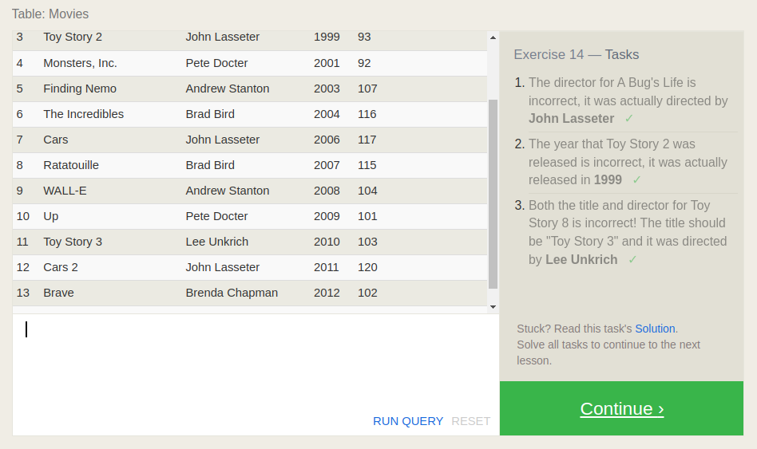

# SQL Practice

[sqlbolt.com](https://sqlbolt.com/)

## Lesson 1

SQL, or Structured Query Language, is a language designed to allow both technical and non-technical users query, manipulate, and transform data from a relational database.

An example query to target specific columns from a table:\
SELECT column, another_column, …\
FROM mytable;

A query to target all columns of a table:\
SELECT *\
FROM mytable;

## Lesson 2

You can use conditionals to help filter data from the database:\
SELECT column, another_column, …\
FROM mytable\
WHERE condition\
    AND/OR another_condition\
    AND/OR …;

### Operators

| Operator | Condition | SQL Example|
| -------- | --------- | ---------- |
| =, !=, < <=, >, >= | Standard numerical operators | col_name != 4 |
| BETWEEN … AND … | Number is within range of two values (inclusive) | col_name BETWEEN 1.5 AND 10.5 |
| NOT BETWEEN … AND … | Number is not within range of two values (inclusive) | col_name NOT BETWEEN 1 AND 10 |
| IN (…) | Number exists in a list | col_name IN (2, 4, 6) |
| NOT IN (…) | Number does not exist in a list | col_name NOT IN (1, 3, 5) |

## Lesson 3

More Operators:

| Operator | Condition | Example |
| -------- | --------- | ---------- |
| = | Case sensitive exact string comparison (notice the single equals) | col_name = "abc" |
| != or <> | Case sensitive exact string inequality comparison | col_name != "abcd" |
| LIKE | Case insensitive exact string comparison | col_name LIKE "ABC" |
| NOT LIKE | Case insensitive exact string inequality comparison | 	col_name NOT LIKE "ABCD" |
| % | Used anywhere in a string to match a sequence of zero or more characters (only with LIKE or NOT LIKE) | col_name LIKE "%AT%"
(matches "AT", "ATTIC", "CAT" or even "BATS") |
| _ | Used anywhere in a string to match a single character (only with LIKE or NOT LIKE) | col_name LIKE "AN_"
(matches "AND", but not "AN") |
| IN (…) | String exists in a list | col_name IN ("A", "B", "C") |
| NOT IN (…) | String does not exist in a list | col_name NOT IN ("D", "E", "F") |

## Lesson 4

### Distinct

Example:

SELECT DISTINCT column, another_column, …\
FROM mytable\
WHERE condition(s);

### Ordered Results

Example:

SELECT column, another_column, …
FROM mytable
WHERE condition(s)
ORDER BY column ASC/DESC;

### Limiting Results

Example:

SELECT column, another_column, …
FROM mytable
WHERE condition(s)
ORDER BY column ASC/DESC
LIMIT num_limit OFFSET num_offset;

## Review

## Lesson 6 Multi-tables

### Multi-table queries with JOIN

Example:

SELECT column, another_table_column, …\
FROM mytable\
INNER JOIN another_table \
    ON mytable.id = another_table.id\
WHERE condition(s)\
ORDER BY column, … ASC/DESC\
LIMIT num_limit OFFSET num_offset;

## Lesson 13 Inserting Rows

## Lesson 14 Updating rows

## Lesson 15 Deleting rows

## Lesson 16 Creating tables

## Lesson 17 Altering tables

## Lesson 18 Dropping tables

